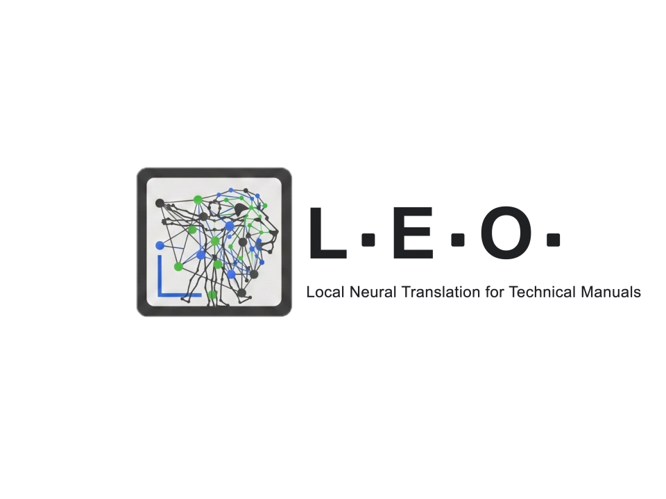

# LEO - Language Extraction and Optimization



## Multilingual NMT Fine-Tuning with LoRA & Seamless-M4T

This repository contains a modular, production-ready pipeline for fine-tuning **Seamless-M4T v2 Large** using **PyTorch Lightning** and **LoRA (Low-Rank Adaptation)**.

It is designed to run efficiently on consumer, single-gpu hardware (e.g., NVIDIA RTX 4090) by leveraging **4-bit quantization (QLoRA)** and Mixed Precision training.

## Features

- **Modular Architecture**: Code is organized into clear modules (`dataset`, `model`, `config`) using PyTorch Lightning.
- **Efficient Fine-Tuning**: Uses PEFT/LoRA to fine-tune only a small fraction of parameters (`q_proj`, `v_proj`, `k_proj`, `o_proj`).
- **4-Bit Quantization**: Loads the 1.3B parameter model in 4-bit precision using `bitsandbytes` to minimize VRAM usage.
- **Multilingual Support**: dynamic handling of source and target languages for many-to-many translation.
- **Custom Tokenization**: Correctly handles `src_lang` and `forced_bos_token_id` for many-to-many translation tasks.
- **Experiment Tracking**: Integrated with Wandb.
- **Synthetic Dataset Generation**: Supports local Ollama models and cloud LLM providers through LiteLLM.
- **Dataset Comparison & Benchmarks**: Versioned synthetic dataset runs, pairwise dataset comparison, and base/LLM benchmark scripts.

## Installation

1. **Clone the repository**:
   ```bash
   git clone https://github.com/MaxDvTn/LEO.git
   cd LEO
   ```
2. **Create a Conda environment**:
   ```bash
   conda create -n LEO python=3.10
   conda activate LEO
   ```

3. **Ceck the GPU and install the correct version of PyTorch**:
   ```bash
   nvidia-smi
   pip3 install torch torchvision torchaudio --index-url https://download.pytorch.org/whl/cu121
   ```

4. **Install Dependencies**:
   ```bash
   pip3 install -r requirements.txt

   ```

   `litellm` is included for cloud-backed synthetic generation (`openai/...`, `anthropic/...`, `google/...`, `deepseek/...`). If you use the Streamlit OAuth UI in the same environment, note that `streamlit-oauth` pins `python-dotenv==1.0.1` while current `litellm` pins `python-dotenv==1.2.2`; use a separate environment if you need both dependency sets to be conflict-free.


## Data Preparation

Prepare a CSV file (e.g., `data.csv`) with the following columns:

| source_text | target_text | source_lang | target_lang |
|-------------|-------------|-------------|-------------|
| Hello world | Ciao mondo  | eng_Latn    | ita_Latn    |
| ...         | ...         | ...         | ...         |

*Note: Ensure language codes match supported FLORES language codes (e.g., `eng_Latn`, `ita_Latn`, `fra_Latn`, `spa_Latn`).*

## Usage

### Unified CLI

Most project operations are available through a small set of command-line entrypoints:

```bash
python scripts/leo.py data full
python scripts/leo.py data pdf-mine
python scripts/leo.py data generate
python scripts/leo.py data test-set
python scripts/leo.py train
python scripts/leo.py benchmark
python scripts/leo.py infer --src-lang eng_Latn --tgt-lang ita_Latn --text "This is a test sentence."
```

Local server and Hugging Face operations use dedicated CLIs:

```bash
python scripts/server.py start
python scripts/server.py status
python scripts/server.py stop

python scripts/hf.py export
python scripts/hf.py upload-model
python scripts/hf.py deploy-space --restart
python scripts/hf.py smoke-test
```

The `scripts/` root is intentionally kept small:
- `leo.py`: data, training, benchmark, inference, and maintenance commands
- `hf.py`: Hugging Face model/Space operations
- `server.py`: local Streamlit/ngrok server management
- `legacy/`: compatibility wrappers for old command names
- `debug/`, `demo/`, `data/`, `hf/`, `maintenance/`, `model/`: focused utility modules

### Synthetic Dataset Generation

LEO can generate synthetic training data with several LLM backends and then
compare, score, and merge the generated CSVs into a curated ensemble. This is
the recommended workflow before fine-tuning NLLB or Seamless.

Generation backend is selected with `conf.gen.model_id` in
[src/common/config.py](src/common/config.py):

```python
model_id = "ollama/qwen2.5:32b"
```

Supported prefixes:

| Prefix | Backend | Example |
|--------|---------|---------|
| `ollama/` | Local Ollama | `ollama/mistral:latest` |
| `openai/` | OpenAI via LiteLLM | `openai/gpt-5-mini` |
| `anthropic/` | Anthropic via LiteLLM | `anthropic/claude-sonnet-4` |
| `google/` | Gemini via LiteLLM | `google/gemini-2.5-flash` |
| `deepseek/` | DeepSeek via LiteLLM | `deepseek/deepseek-chat` |

For cloud providers, export the matching API key before running generation:

```bash
export OPENAI_API_KEY=...
export GEMINI_API_KEY=...
export ANTHROPIC_API_KEY=...
export DEEPSEEK_API_KEY=...
```

Gemini is accessed through LiteLLM with the `google/` prefix. If credentials are
stored in `.env`, keep the file out of git and load it in the shell/session
before running the suite.

Generate glossary-based synthetic data with the single model configured in
`conf.gen.model_id`:

```bash
python scripts/leo.py data generate
```

Every generated synthetic CSV is saved in multiple places:

- active training file, e.g. `data/synthetic/glossary_synthetic.csv`
- previous active file archived under `data/synthetic/archive/`
- versioned copy under `data/synthetic/runs/`, including model name and timestamp
- for PDF mining, partial checkpoint CSVs are written under
  `data/synthetic/checkpoints/` so long runs can resume without losing all
  completed rows

The main dataset kinds are:

| Kind | Command value | Source | Output shape |
|------|---------------|--------|--------------|
| Glossary | `glossary` | curated technical terms in `src/synthesis/glossary_data.py` | one row per generated translation pair |
| Web | `web` | competitor/industry pages from `SpiderConfig.target_urls` | scraped terms expanded into translation pairs |
| PDF | `pdf` | PDFs in `data/raw/pdfs/` | mined sentences translated IT→EN/FR/ES and native EN/FR/ES→IT |

Glossary and web generation call `generator.generate_dataset()` and normalize
the LLM output into this long format:

```text
source_text,target_text,source_lang,target_lang,origin,model_id,prompt_version,created_at,term,context
```

PDF generation is heavier. It extracts and segments all PDFs, detects a coarse
source language, then translates:

- Italian/unknown sentences to English, French, and Spanish.
- Generated English/French/Spanish translations back to Italian as reverse pairs.
- Native English/French/Spanish PDF sentences directly to Italian.

Because PDF runs can involve tens of thousands of sentences, they should be run
separately from glossary runs. The checkpoint file name includes the model, for
example:

```text
data/synthetic/checkpoints/rover_pdf_augmented__ollama_mistral-small3.2.csv
```

### Multi-Model Dataset Suite

Use the suite runner to generate datasets with multiple models, compare the outputs, and benchmark the same generators on the test set in one command:

```bash
python scripts/data/run_generation_suite.py \
  --models ollama/mistral-small3.2 ollama/gemma3:27b ollama/qwen2.5:32b google/gemini-2.5-flash ollama/aya-expanse:8b \
  --dataset-kind glossary \
  --benchmark-sample-size 20 \
  --skip-ppl
```

Useful options:

```bash
# Generate and compare only, without benchmark cost.
python scripts/data/run_generation_suite.py \
  --models ollama/mistral-small3.2 ollama/qwen2.5:32b google/gemini-2.5-flash \
  --dataset-kind glossary \
  --skip-benchmark

# Run the suite on web-spidered terms instead of the glossary
python scripts/data/run_generation_suite.py \
  --models openai/gpt-5-mini google/gemini-2.5-flash \
  --dataset-kind web

# Run PDF mining separately. This can be very long and should use checkpointing.
python scripts/data/run_generation_suite.py \
  --models ollama/mistral-small3.2 google/gemini-2.5-flash \
  --dataset-kind pdf \
  --skip-benchmark \
  --skip-judge \
  --skip-ppl
```

The suite writes a manifest and artifacts under:

```text
runs/generation_suite/<timestamp>/
```

For each model, the suite:

1. Sets `conf.gen.model_id` to the requested model.
2. Instantiates the matching generator backend.
3. Generates a model-specific CSV.
4. Saves a canonical active file and a versioned run file.
5. Optionally compares all generated datasets pairwise.
6. Optionally evaluates dataset statistics, LLM judge scores, perplexity, and
   generator benchmark results.

Local Ollama worker counts are chosen conservatively by model size:

| Model size | Typical examples | Workers |
|------------|------------------|---------|
| 20B+ | `qwen2.5:32b`, `gemma3:27b`, `mistral-small3.2` | 2 |
| 12B-14B | `mistral-nemo`, `phi4` | 3 |
| Smaller/unknown | `aya-expanse:8b` | `conf.gen.num_workers` |
| Cloud APIs | Gemini/OpenAI/etc. | `conf.gen.cloud_num_workers` |

If Ollama is managed by systemd, parallel requests require:

```ini
[Service]
Environment="OLLAMA_NUM_PARALLEL=4"
```

followed by:

```bash
sudo systemctl daemon-reload
sudo systemctl restart ollama
systemctl show ollama --property=Environment
```

### Ensemble Dataset

After several model runs have been generated, build the training ensemble:

```bash
python scripts/leo.py data build-ensemble
```

The ensemble builder reads versioned CSVs from `data/synthetic/runs/`, applies:

- exact duplicate removal
- near-duplicate removal on `source_text`
- quality filtering
- model priority ordering, so stronger generators are preferred when several
  models produce near-identical samples

The result is:

```text
data/synthetic/ensemble_training_set.csv
```

When this file exists, the training dataloader uses a curated synthetic pool:

```text
data/synthetic/rover_synthetic_multilingual.csv
data/synthetic/competitor_synthetic.csv
data/synthetic/ensemble_training_set.csv
```

This avoids accidentally training on duplicated top-level files such as older
`glossary_synthetic.csv` outputs while keeping the stable historical synthetic
corpus.

### Dataset Quality Checks

While a suite is running, inspect generated files with:

```bash
ls -lh data/synthetic/runs | tail -20
```

Check row counts, languages, and model distribution:

```bash
python -c "import glob, pandas as pd
for p in sorted(glob.glob('data/synthetic/runs/*.csv')):
    df = pd.read_csv(p)
    print('\n', p)
    print('rows:', len(df))
    print('langs:', df['target_lang'].value_counts().to_dict() if 'target_lang' in df else {})
    print('models:', df['model_id'].value_counts().to_dict() if 'model_id' in df else {})"
```

Check malformed rows:

```bash
python -c "import glob, pandas as pd
for p in sorted(glob.glob('data/synthetic/runs/*.csv')):
    df = pd.read_csv(p)
    required = ['source_text', 'target_text', 'source_lang', 'target_lang']
    bad = df[df[required].isna().any(axis=1)]
    empty = df[(df['source_text'].astype(str).str.strip() == '') | (df['target_text'].astype(str).str.strip() == '')]
    print(p, 'rows=', len(df), 'bad_na=', len(bad), 'empty=', len(empty))"
```

### Dataset Comparison

Compare any two synthetic CSVs with:

```bash
python scripts/data/compare_synthetic.py \
  data/synthetic/runs/glossary_synthetic__ollama_mistral_latest__OLD.csv \
  data/synthetic/runs/glossary_synthetic__openai_gpt-5-mini__NEW.csv
```

The report includes row deltas, overlap, language/origin distribution, and added/removed samples.

### Benchmarks

Benchmark non-finetuned Hugging Face seq2seq base models:

```bash
python scripts/model/benchmark_base_models.py \
  --models facebook/nllb-200-3.3B facebook/seamless-m4t-v2-large
```

Benchmark prompt-based LLM generators:

```bash
python scripts/model/benchmark_llm_generators.py \
  --models ollama/mistral:latest openai/gpt-5-mini \
  --sample-size 10
```

Benchmark outputs are written under:

```text
benchmarks/base_models/<timestamp>/
benchmarks/llm_generators/<timestamp>/
```

### Training

To start or resume fine-tuning:

```bash
python scripts/leo.py train
```

**Key Hyperparameters** (editable in `config.py`):
- `batch_size`: 12
- `accumulate_grad_batches`: 3
- `learning_rate`: 5e-5
- `max_epochs`: 20
- `precision`: "bf16-mixed" (Optimized for Ampere+ GPUs)

### Inference

To translate text using a trained checkpoint:

```bash
python scripts/leo.py infer \
    --checkpoint checkpoints/last.ckpt \
    --src-lang eng_Latn \
    --tgt-lang ita_Latn \
    --text "This is a test sentence."
```

## Student Validation App

To launch the data validation interface for students (Streamlit + Ngrok):

1. **Start the Server**:
   Run the helper script which sets up a tmux session with Streamlit and the Ngrok tunnel:
   ```bash
   python scripts/server.py start
   ```
   The compatibility wrapper `./scripts/start_server.sh` runs the same command.

2. **Access**:
   - **Admin/Monitor**: Attach to the session with `tmux attach -t server`.
   - **Students**: Share the link provided in [GUIDE_STUDENTS.md](GUIDE_STUDENTS.md) (e.g., `https://concretely-dendroid-florinda.ngrok-free.dev`).
   - **Authentication**: Usage is restricted to `@liceodavincitn.it` Google accounts.

For detailed student instructions, see **[GUIDE_STUDENTS.md](GUIDE_STUDENTS.md)**.

## Deploy to Hugging Face Spaces

You can easily deploy the Translation Hub to a public Hugging Face Space.

1. **Login to Hugging Face**:
   Make sure you have an account and a write-access token (Settings -> Access Tokens).
   ```bash
   huggingface-cli login
   ```

2. **Deploy**:
   Run the deployment script, which handles:
   - Exporting the LoRA adapters.
   - Creating the Model and Space repositories on your account.
   - Uploading files and configuring the Space.
   
   ```bash
   # Ensure you are in the LEO environment
   conda activate LEO
   
   # Export adapters, upload model files, deploy the Space, and restart it
   python scripts/hf.py export
   python scripts/hf.py upload-model
   python scripts/hf.py deploy-space --restart
   ```

   The script will output the URL of your new Space (e.g., `https://huggingface.co/spaces/YourUsername/leo-translation-hub`).

### Current Translation Space UX

The Translation Hub UI now supports:
- **Input language dropdown** (`Italian`, `English`, `French`, `Spanish`)
- **Output language dropdown** (`Italian`, `English`, `French`, `Spanish`)
- **Bidirectional translation**, including translations **towards Italian**

The Space reads the adapter model from the `ADAPTER_PATH` environment variable (currently set to `maxbsdv/LEO-SeamlessM4T-v2-Large-Roverplastik`).

## Project Structure

- `config.py`: Central configuration for model parameters and paths.
- `dataset_module.py`: `LightningDataModule` handling data loading, splitting, and tokenization.
- `model_module.py`: `LightningModule` wrapping the NLLB model with LoRA and defining training steps.
- `train.py`: Main entry point for training.
- `inference.py`: Script for loading adapters and generating translations.

## License

[MIT](LICENSE)
